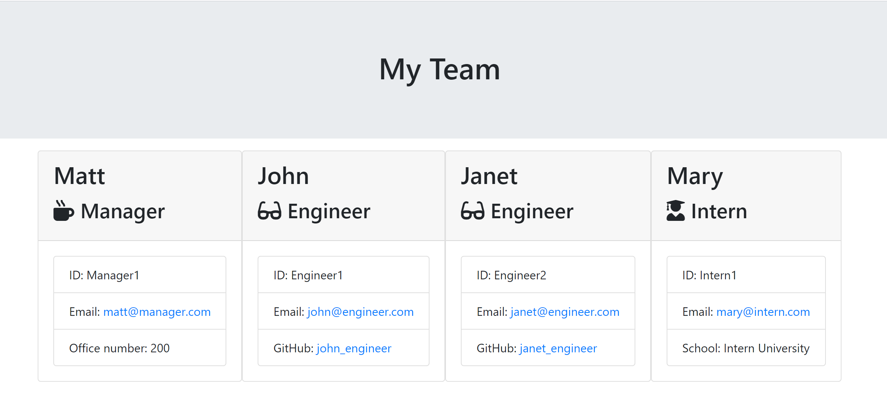

# The Team Generator

## Table of Contents
* [Description](#description)
* [Installation](#installation)
* [Testing](#testing)
* [Screenshots](#screenshots)

## Description
This program builds a software engineering team in the browser via a command line application (Node CLI). The application prompts user for what type of team member is being added and then asks specific questions about that role. Once all team members are added, then application will output an HTML file with all team members formatted in cards. 

## Installation
This application requires you to download the Inquirer npm package as well as jest for running tests.

## Testing
This application uses jest to run testing. You can run the tests by typing "npm run test" in the terminal.

## Screenshot
Click on the screenshot for a video running through the code in the terminal:

